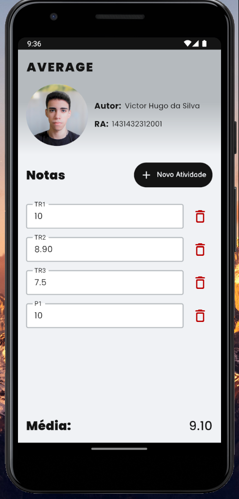
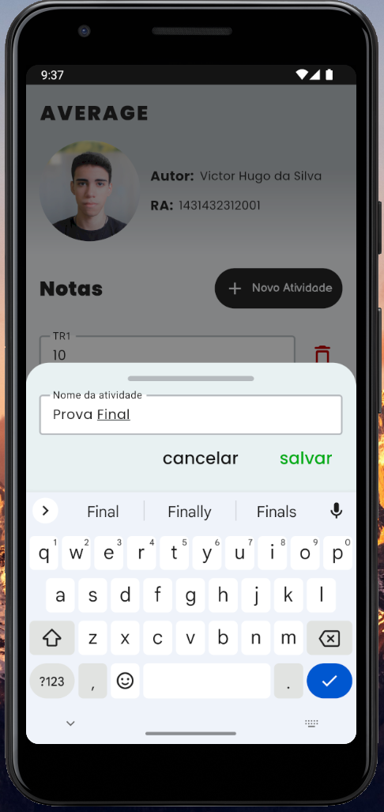
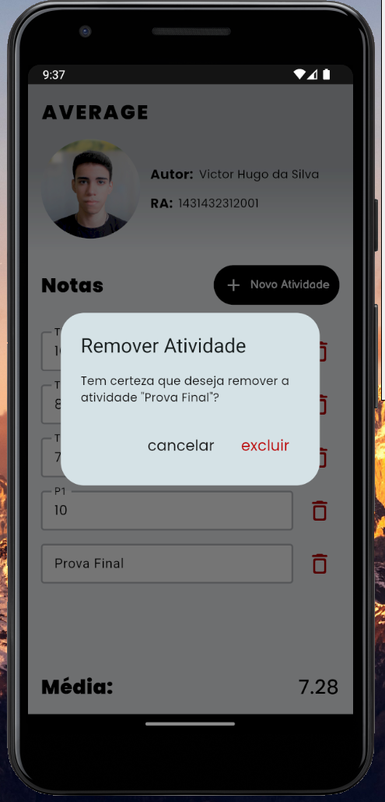

# Average - Stateful Flutter Aplication

### NP3 - TR7 - Calculadora acadêmica | Feito Por Victor Hugo da Silva.

Calculadora acadêmica feito em `Flutter` para obter nota média entre as atividades. Aplicativo para ser entregue como atividade da matéria de Desenvolvimento Web & Mobile.

### Preview

  
  
  

### Google Fonts

- Poppins (300, 400, 500, 700, 900)
- Balsamiq Sans (400, 700)

### Dependencies

- <a href="https://pub.dev/packages/uuid" target="_blank">UUID</a>
